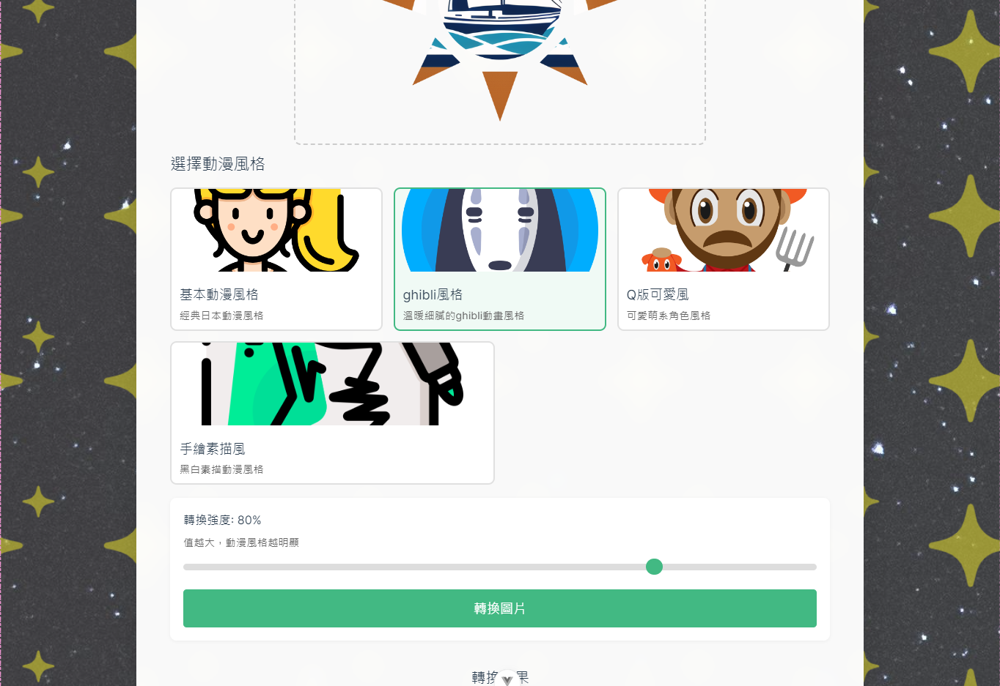
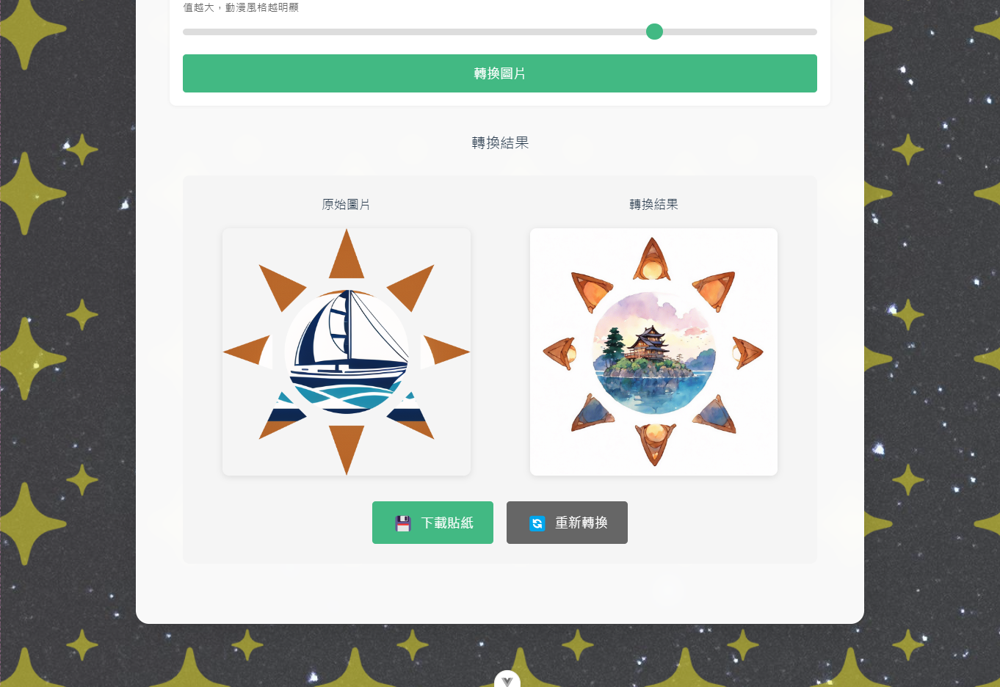

# 照片動漫貼紙製作器 🎨


一個使用 Vue 3 和 Stable Diffusion API 開發的網頁應用，可以將您的照片轉換成各種動漫風格的貼紙。

## ✨ 特色功能

- 🖼️ 支持拖放上傳圖片
- 🎭 多種動漫風格選擇
- 🎚️ 可調整轉換強度
- 💾 自動保存歷史記錄
- 📱 響應式設計，支持移動設備
- 🌟 精美的星空背景動畫

## 🖼️ 應用截圖

### 首頁&風格選擇


*上傳圖片並選擇風格*

### 結果預覽


*結果供預覽*

### 作品集


*查看並管理已生成的貼紙*

## 🚀 快速開始

1. 克隆專案：

```sh
npm install
```

### Compile and Hot-Reload for Development

```sh
npm run dev
```

### Compile and Minify for Production

```sh
npm run build
```

## 🛠️ 技術棧

- 🖖 Vue 3 + Composition API
- ⚡ Vite
- 🗃️ Pinia 狀態管理
- 📦 IndexedDB 本地存儲
- 🎨 Stable Diffusion API
- 🌐 Vue Router

## 📝 待辦事項

- [ ]  添加更多動漫風格
- [ ]  支持批量處理
- [ ]  添加圖片編輯功能
- [ ]  支持社交媒體分享
- [ ]  添加用戶認證系統

## 🤝 貢獻

歡迎提交 Pull Request 或創建 Issue！

## 📄 授權

本項目基於 [MIT 授權](LICENSE) 發布。

## 🙏 鳴謝

- [Stability AI](https://stability.ai/) - 提供圖像轉換 API
- [Vue.js](https://vuejs.org/) - 優秀的前端框架
- [Vite](https://vitejs.dev/) - 極速的開發工具
